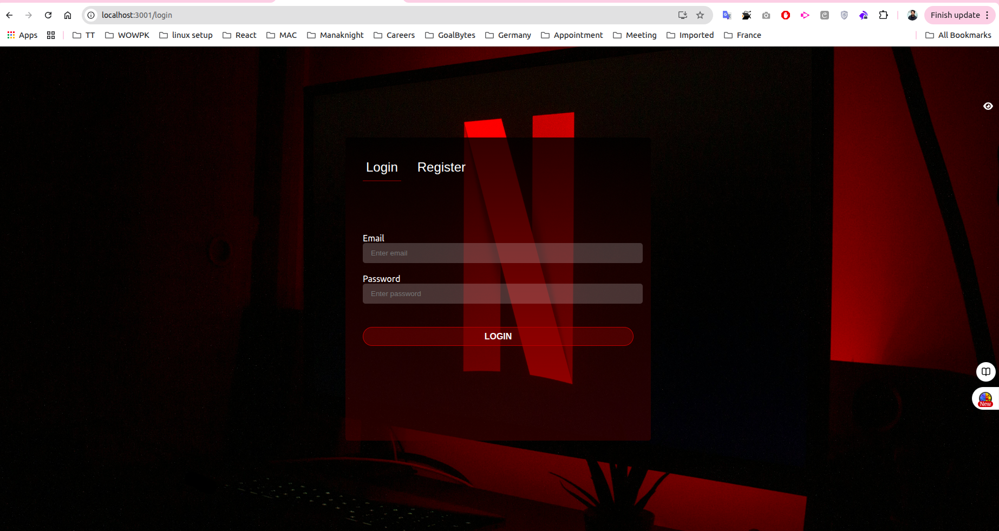
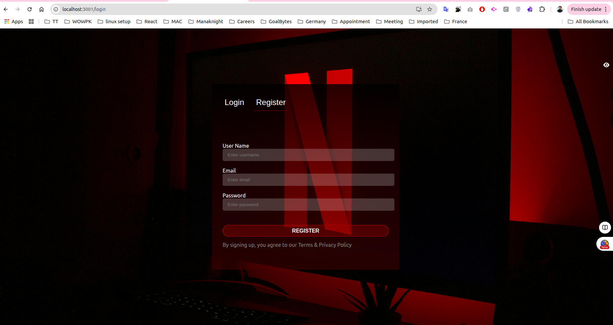

# Movie App

A React-based movie application with user authentication.

## Login/Registration Page

The login page features a tabbed interface allowing users to switch between Login and Register forms.

### Features Implemented

- **Tab Navigation**: Users can switch between Login and Register tabs
- **Active Tab Indicator**: White border-bottom highlights the currently active tab
- **Conditional Rendering**: Forms are rendered based on the selected tab using React state
- **classnames Package**: Used for cleaner conditional class handling

### Screenshots

#### Login Page


#### Registration Page


### Key Technologies & Concepts Used

1. **React Hooks**
   - `useState` for tab state management
   - `useReducer` for form state management

2. **Conditional Class Names**
   ```jsx
   import classNames from "classnames";
   
   className={classNames({ active: tab === tabs.LOGIN })}
   ```

3. **Component Structure**
   - `LoginPage.js` - Main page with tab navigation
   - `LoginForm.js` - Login form component
   - `RegistrationForm.js` - Registration form component


---

## Available Scripts

In the project directory, you can run:

### `npm start`

Runs the app in the development mode.\
Open [http://localhost:3000](http://localhost:3000) to view it in your browser.

### `npm test`

Launches the test runner in the interactive watch mode.

### `npm run build`

Builds the app for production to the `build` folder.
